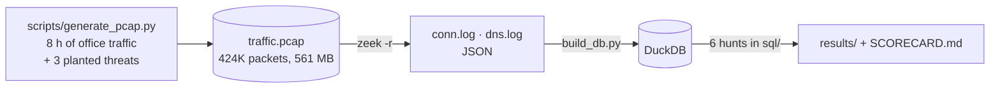

# PCAP Threat Hunting

_Portfolio sprint timeline: January–September 2026. Reported results retain their actual run dates._

Network threat hunting the way a SOC does it: packet capture → Zeek logs → SQL over the logs to
find what signature rules cannot see — **beaconing** by timing regularity, **DGA** by DNS entropy,
**exfiltration** by byte asymmetry — scored against planted ground truth.



## Results ([`results/SCORECARD.md`](results/SCORECARD.md))

| planted threat | hunt | rank | how it was found |
|---|---|---:|---|
| C2 beacon: `10.10.2.117 → 45.133.1.9:443` every 60 s ± 5 %, 451 connections | [H1 beaconing](sql/01_beaconing.sql) | **1** | interval coefficient of variation 0.029 vs ≥ 0.66 for every human-driven flow; payload size CV 0.019 |
| DGA: `10.10.3.42` resolving 40 random `.xyz/.top/.club` names | [H2 DNS entropy](sql/02_dga_dns.sql) | **1** (only host flagged) | mean Shannon entropy 3.19, 90 % NXDOMAIN, 100 % cheap TLDs |
| Exfil: `10.10.1.77 → 185.220.101.9`, 38 MB out / 0.12 MB in over 40 min | [H3 asymmetry](sql/03_exfiltration.sql) | **1** | out/in ratio 317; next highest 0.8 (a video call) |
| Benign VPN and video call, both > 1 h | [H4 long connections](sql/04_long_connections.sql) | listed | duration alone is a triage list; symmetry separates them from the exfil |

Corpus: 14,650 connections, 7,088 DNS queries, 59 internal hosts, 8 hours. All three threats look
like ordinary HTTPS to a rule engine — no known-bad IP, no signature, nothing on the wire but TLS.

## Why synthetic traffic

Real captures contain real people's browsing and cannot be published; public malware PCAPs are
short, single-host and have no benign baseline to hide in. The generator writes eight hours of
plausible office traffic (60 workstations, human-like inter-request gaps drawn from an exponential
distribution, real DNS names, NTP, a VPN, a video call) and plants three threats with recorded
parameters, so every hunt has a ground truth to score against. Swap in your own PCAP and the same
queries run unchanged.

## The hunts

| # | Question | Technique |
|---|---|---|
| [01](sql/01_beaconing.sql) | Which (src, dst, port) pairs connect on a timer? | `LAG` over timestamps per pair → interval CV × size CV × log(count) |
| [02](sql/02_dga_dns.sql) | Which hosts query machine-generated names? | Shannon entropy per name computed in SQL from character frequencies, NXDOMAIN rate, TLD mix |
| [03](sql/03_exfiltration.sql) | Which single connections upload far more than they download? | bytes-out / bytes-in on external TCP |
| [04](sql/04_long_connections.sql) | What has been connected for over 30 minutes? | duration, with symmetry to separate VPN from shell |
| [05](sql/05_rare_destinations.sql) | Which external IPs does only one host talk to, and were they ever resolved by DNS? | anti-join of conn destinations against DNS answers |
| [06](sql/06_host_summary.sql) | Per-host: connections, destinations, bytes, NXDOMAINs, out/in ratio | the analyst's starting table |

## Run it

```bash
git clone https://github.com/prhoguns/pcap-threat-hunting.git && cd pcap-threat-hunting
pip install -r requirements.txt
python scripts/generate_pcap.py                                             # ~6 min, 561 MB
docker run --rm -v "$PWD":/app -w /app/zeek zeek/zeek:7.0 zeek -C -r /app/data/traffic.pcap LogAscii::use_json=T
python scripts/build_db.py && python scripts/run.py                         # results/ + scorecard
```

Your own capture: drop it at `data/traffic.pcap`, run Zeek and the last line. The hunts assume
RFC1918 internal space (`10.%`); edit the `like '10.%'` filters otherwise.

## Things learned the hard way

- Zeek needs monotonic timestamps. Writing each synthetic flow as a burst produced 336,000
  half-open "connections"; buffering and sorting packets by time before writing fixed it.
- scapy's `RawPcapWriter._write_packet` does not write the file header; `_write_header` first.
- 380 MB of exfil as 1,400-byte packets is 270,000 scapy objects and a 20-minute generation; 38 MB
  makes the same point.

## Next

- Zeek `ssl.log` and JA3/JA4 fingerprints: beacons with a fixed TLS fingerprint across many hosts.
- Suricata alongside Zeek for the signature side, then a join: which anomalies *also* hit a rule?
- Stream the conn.log into the [SOC alert analytics](https://github.com/prhoguns/soc-alert-analytics) feature set.
